# Windows Server & Active Directory Home Lab

Hands-on practice lab for IT administration and SOC fundamentals, built by Mesum Temar.

> **Note:** This is a learning lab in a test environment (Azure free account). I followed tutorials and documentation and wrote down what I did and learned. It is not production experience.

## Environment

| Item | Value |
|------|-------|
| Platform | Microsoft Azure (free account) |
| Server | Windows Server 2022 Datacenter, VM name `DC01` |
| Size | Standard D2lds_v7 (2 vCPU, 4 GiB RAM), Germany West Central |
| Domain | `lab.local` |
| Access | Remote Desktop (RDP) from macOS (Windows App) |

## Lab checklist

- [x] 1. Create the Azure VM and connect via RDP
- [x] 2. Install Active Directory Domain Services and DNS, promote `DC01` to domain controller
- [x] 3. Create OUs, users and groups; reset a password; unlock an account
- [x] 4. Create a Group Policy (GPO) (configured; not yet tested on a domain client)
- [x] 5. Create a file share with NTFS permissions via a group (configured; access not yet tested from a client)
- [x] 6. Install the DHCP role and create a scope (scope left inactive)
- [x] 7. Back up with Windows Server Backup and restore deleted items
- [x] 8. PowerShell: create users from a CSV file

## Lab notes

### 1. Azure VM and RDP
- **What I did:** Created a Windows Server 2022 Datacenter (x64 Gen2, Trusted launch) VM named `DC01` in an Azure free account, set a budget alert in Cost Management, connected via RDP with Windows App on macOS, and set a static private IP on the network interface so the domain controller's address does not change.
- **Why Azure:** My Mac has an ARM chip (M4). Windows Server is x64, and emulating it locally in UTM was too slow and the installer failed, so I used a cloud VM instead.
- **Problems and fixes:** Some VM sizes and regions were "not available for subscription", so I tried other sizes/regions until D2lds_v7 in Germany West Central worked. I first picked Server Core and Hotpatch images by mistake and switched to the normal Datacenter image with the desktop. I stop (deallocate) the VM after each session to save credit.

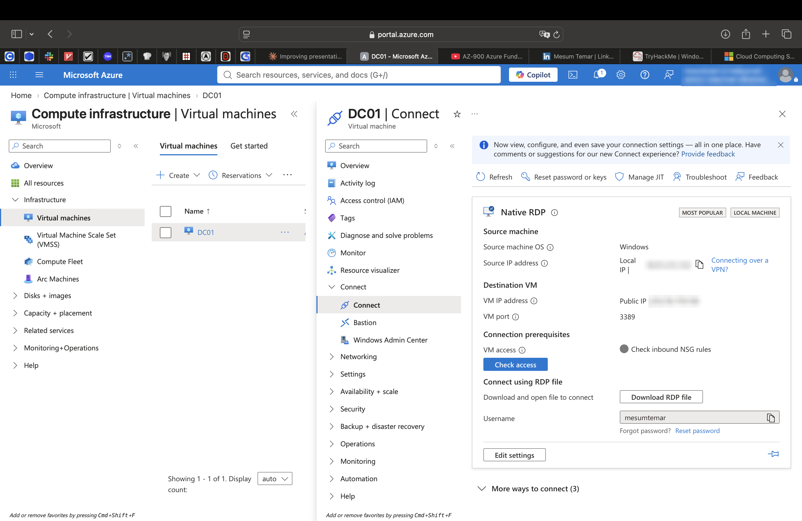

### 2. Active Directory and DNS
- **What I did:** Installed the Active Directory Domain Services role in Server Manager and promoted `DC01` to a domain controller of a new forest, `lab.local` (DNS and Global Catalog included, NetBIOS name `LAB`). The server restarted and I logged in afterwards as `LAB\mesumtemar`.
- **Problems and fixes:** After the restart my login failed because the account had become a domain account. I reset the password via Azure Run Command (`Set-ADAccountPassword`, `Unlock-ADAccount`) and logged in with the `LAB\` prefix.

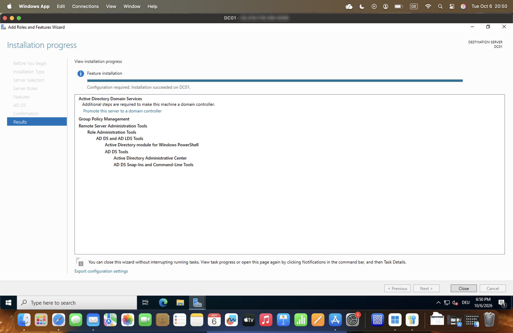

### 3. Users, groups, password reset
- **What I did:** In Active Directory Users and Computers I created an OU structure `Company` with sub-OUs `Users`, `Groups` and `Computers`, created two test users in `Company\Users`, and created security groups (IT, Sales, Factory, Human resources) in `Company\Groups`. OUs organize objects and let me apply policies to them later; groups are used to give access to many users at once.
- **Members and password reset:** Added both test users to the `IT` group and reset a user's password with the option to unlock the account.

OU structure and users:

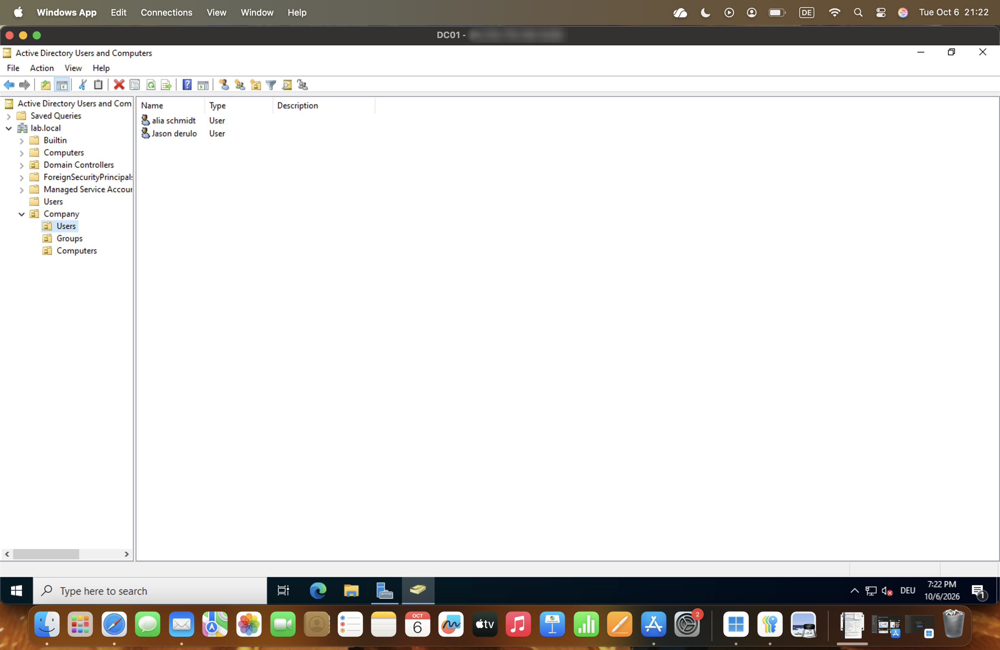

Security groups:

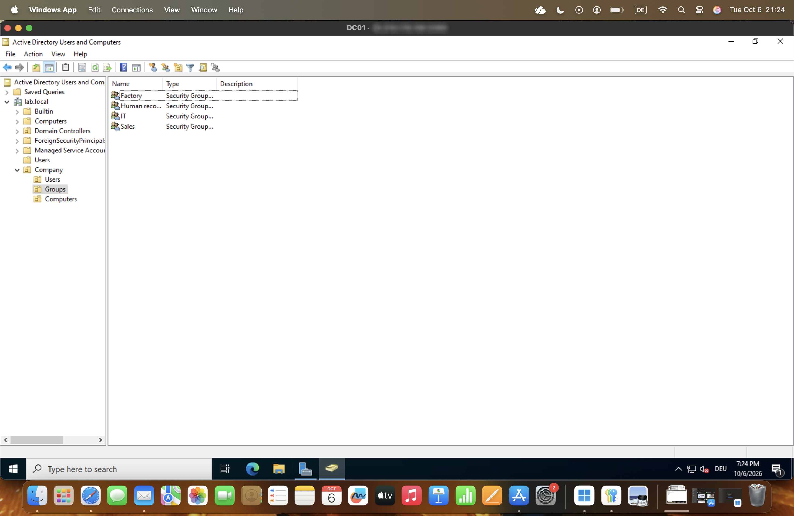

Members of the IT group:

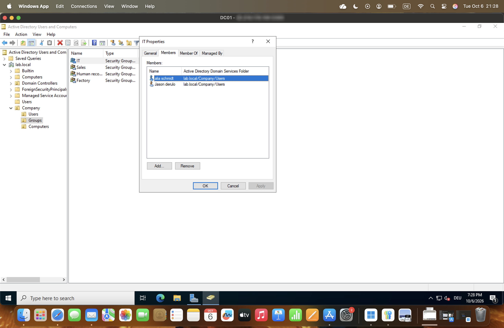

### 4. Group Policy
- **What I did:** In Group Policy Management I created GPOs and linked them to OUs:
  - `Block-ControlPanel` (linked to the `Company` OU): User Configuration > Administrative Templates > Control Panel > *Prohibit access to Control Panel and PC settings* = Enabled. Applies to users in `Company`, not to my admin account (which is outside that OU).
  - `Protect Endpoint Security` (linked to `Company\Computers`): hides the Windows Security *Firewall and network protection* area from users (Computer Configuration > Administrative Templates > Windows Components > Windows Security). Defender and the firewall stay on; the goal is that users cannot change them.
  - `USB Block` (linked to `Company\Computers`): *Prevent installation of removable devices* = Enabled (Device Installation Restrictions) and *Removable Disks: Deny write access* = Enabled (Removable Storage Access).
- **What I learned:** A GPO applies to the users or computers in the OU it is linked to (and sub-OUs). User settings follow the user, computer settings follow the computer. Domain controllers are not in the Computers OU, so these policies do not change DC01.
- **Limit:** I have not yet tested the policies on a domain-joined client computer (needs a second VM), so they are configured but not verified.

Overview of the GPOs and the link to the OU:

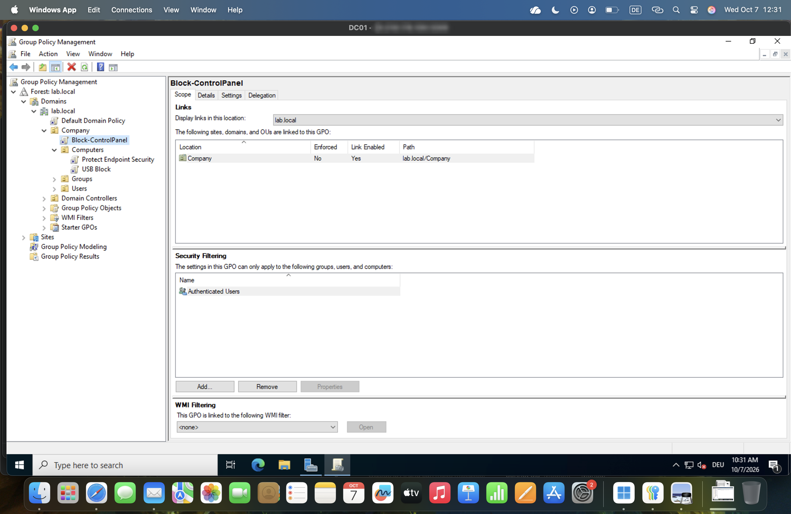

Control Panel setting enabled:

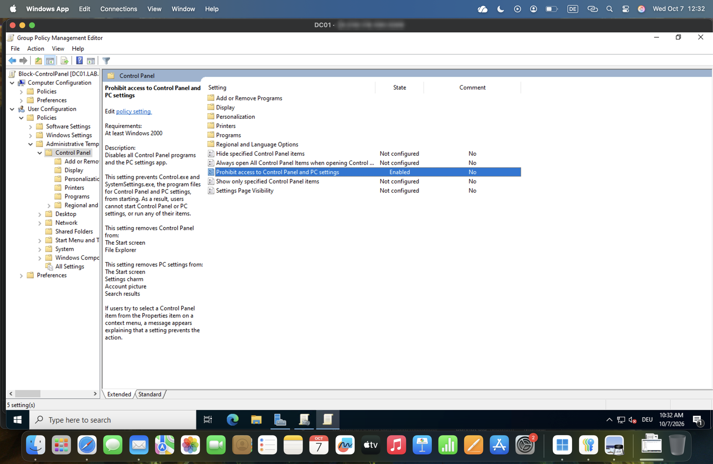

Hide the Firewall and network protection area:

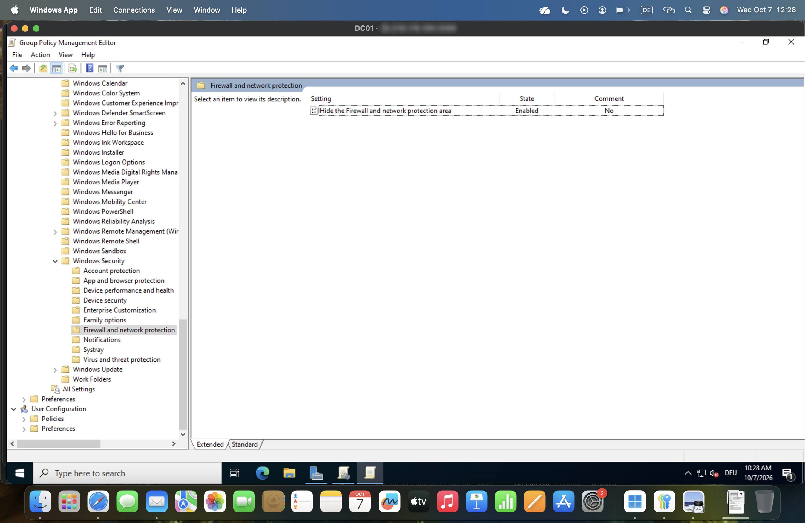

USB Block settings report:

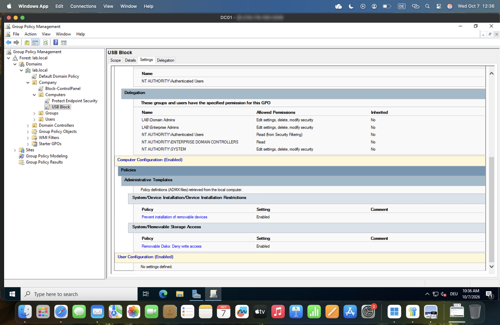

### 5. File share and NTFS permissions
- **What I did:** Created the folder `C:\Company` and shared it as `\\DC01\Company`. Share permissions are open and the real control is done with NTFS permissions: I disabled inheritance (converted to explicit permissions), gave the group `IT` **Modify**, gave the group `Sales` **Read & execute** only, and removed the broad default groups (Authenticated Users, Users). Only IT, Sales, Administrators and SYSTEM remain.
- **What I learned:** Access is given to groups, not individual users. Share permissions and NTFS permissions are combined and the stricter one wins. A default folder created on `C:\` gives Authenticated Users Modify, which would have let every domain user change files, so I removed it.
- **Limit:** I have not yet tested the access by logging in as a test user from a client computer.

IT group has Modify:

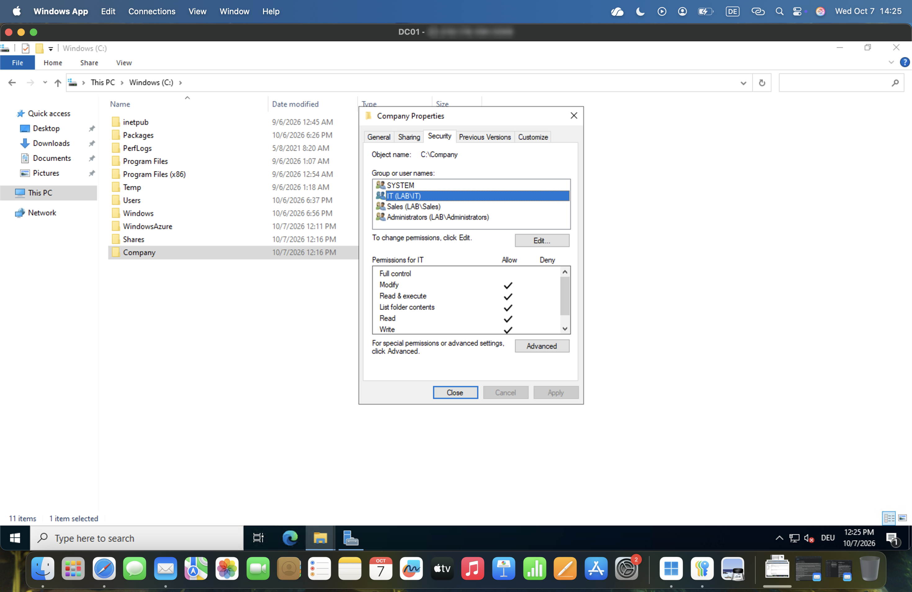

Sales group has Read & execute only:

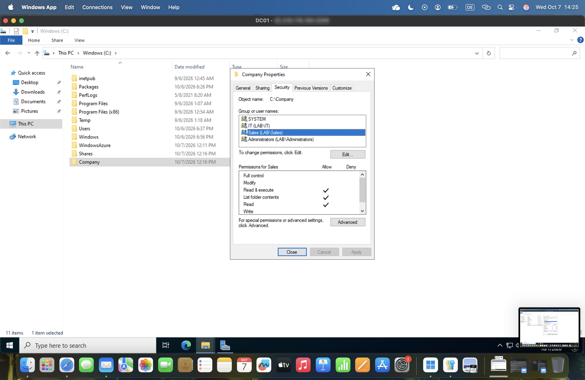

Share and network path:

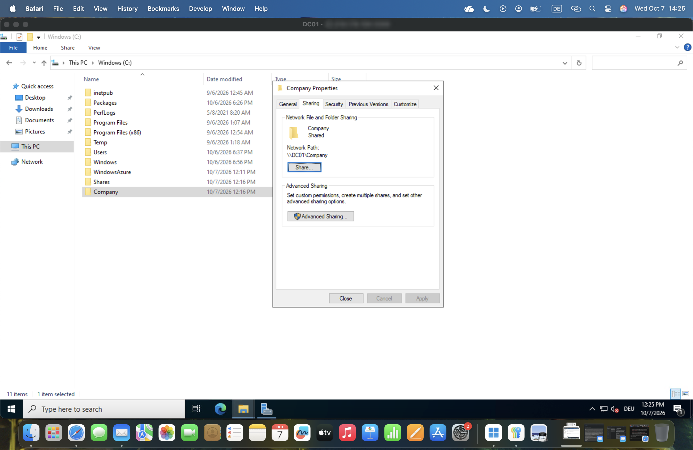

### 6. DHCP
- **What I did:** Installed the DHCP Server role and completed the post-install configuration. Created the scope `Lab-Scope` (`192.168.10.0/24`) with an address range of `192.168.10.20` to `192.168.10.180` (161 addresses), default lease time, and left the options to configure later.
- **Note:** The scope is deliberately left **inactive**. In Azure the virtual network already provides IP addresses to VMs, so an active DHCP server would not work as on a normal network. This step is practice for the configuration, not a working DHCP service.
- **What I learned:** How to plan a scope (keep fixed addresses for servers and the gateway outside the pool, size it by number of devices, choose lease time by device type) and use a private address range.

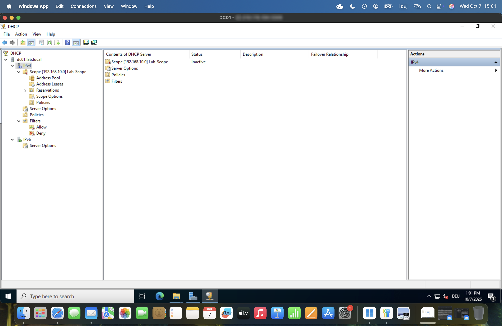

### 7. Backup and restore
- **What I did:** Added a second 32 GiB data disk to the Azure VM (Disk Management: initialize, new simple volume `E:` NTFS, label `Backup`). Installed the Windows Server Backup feature and ran a one-time backup (Backup Once) of the server to `E:` (11.73 GB: C:, EFI system partition, recovery partition, system state and bare metal recovery). Then I deleted items from `C:\Company` and restored them with the Recovery Wizard to the original location. The recovery completed.
- **Problems and fixes:** The backup wizard first offered only the small Recovery (about 450 MB) and EFI partitions as destinations, because I had attached the new disk but not yet created a volume on it. After creating the volume the 32 GB disk was available.
- **What I learned:** The 3-2-1 backup rule, the difference between backup and restore, and that a backup must be tested with a restore. In production the backup would go to a separate system or the cloud (for example Azure Backup with a Recovery Services vault), not to a second disk of the same server.

Backup completed:

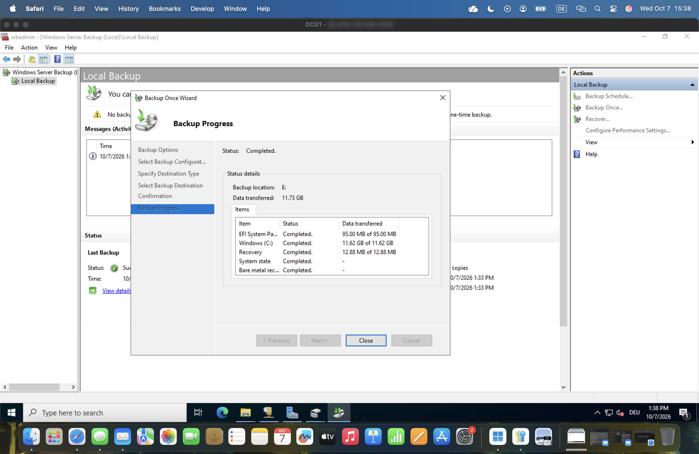

Restore completed:

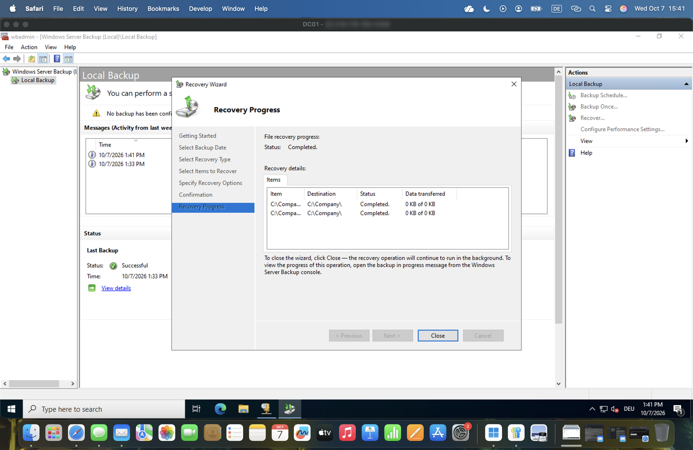

### 8. PowerShell
- **Script:** `scripts/create-users.ps1` (input file: `scripts/users.csv`)
- **What it does:** Reads `users.csv` with `Import-Csv`, loops through every row, checks with `Get-ADUser` whether the user already exists, creates the user in `OU=Users,OU=Company` with `New-ADUser` (enabled, must change password at first logon) and adds the user to the group named in the Department column with `Add-ADGroupMember`. It prints one line per user.
- **Note:** I wrote this script with AI assistance and I ran it in my lab. I went through it line by line and can explain what each part does. The password in the script is a lab-only test password.
- **Result:** Three users (Lena Fischer, Tom Becker, Nina Wolf) were created and added to the groups IT and Sales.

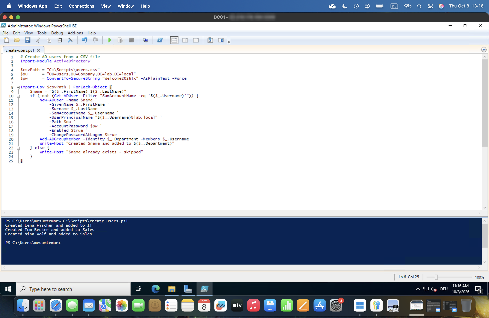

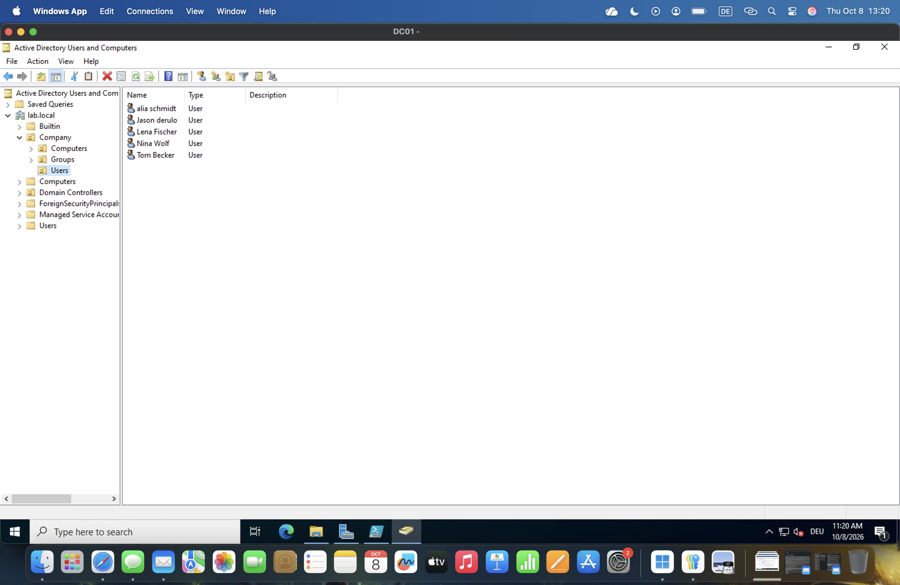

## What I learned

- An Active Directory domain is organised as a tree: OUs are folders, and every object has a distinguished name such as `CN=Lena Fischer,OU=Users,OU=Company,DC=lab,DC=local`, read from the most specific part to the domain root.
- Permissions are best given to groups, not single users (IT = Modify, Sales = Read). With a file share, NTFS and share permissions are combined and the stricter one wins.
- A GPO only applies where it is linked (here: to an OU) and only to the users or computers in its scope, so the setting has to match the scope (user vs. computer settings).
- A backup is only proven by a test restore, and the 3-2-1 rule (3 copies, 2 media types, 1 offsite) is the standard to aim for.
- PowerShell can replace repeated clicking: reading a CSV and creating users with `New-ADUser` is faster and more consistent. I wrote this script with AI help, but I went through it line by line and can explain it.
- Running a lab in Azure also taught me to watch costs: stop (deallocate) the VM after each session and check Cost Management.

## Next steps

- CompTIA CySA+, Microsoft AZ-900
- Add a second VM as a domain client to test GPOs
- Practice Microsoft 365 / Entra ID in a trial tenant
